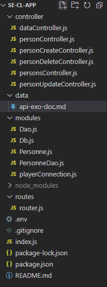

This is the documentation for the API made with nodejs  
12/03/2022
mkdocs hosted on gh pages:  
https://omnislashh.github.io/LPCodesiApiRestDoc/
***
- description: 
//API REST avec express
Administrer des joueurs et des équipes

- repository: https://github.com/omnislashh/ser-cli-app.git

- outils: Windows10, Wamp, nodejs, expressjs, postman

- utilisation: CRUD

- endpoints uri:
/persons
/person/:id
/data/:options
/personcreation
/personupdate
/persondelete

- endpoints exemples:
http://localhost:3000/personupdate?id=35&name=updated&prenom=prenomUp&date=1980-05-06

- verbes http et justifications:
Verbes utilisés:
PUT 
PATCH

- codes utilisés: 201...

- architecture: MVC - client/server en local

- arborescence:

- design pattern:

1. singleton pour se connecter une seule fois
2. choix design pattern pour Data Access Object:
table data getaway design pattern vs active record

avantage table data getaway:
separe la couche metier de la couche persistante

//class Dao implemente le Dal (Data Access Layer)
//js pas de classe abstraite
// classe abstraite  
// empecher la creation d'objet + lister les methodes qui doivent etre implantée + declencher des erreurs 
// en js
// 1 - code heroes

// 2 - babel - pas en prod

// 3 - use typescript
- bdd:

- jwt:
ajout d'une couche de securité/connexion user avec le bearer token

// https://www.wawasensei.dev/tuto/tuto-authentification-refresh-json-web-token-en-nodejs-avec-express

//stateless: sans stocker d'infos user
//statefull: avec stockage de session
//connexion s'appuie sur 2 tokens: l'un qui repose sur l'autre
//deconnexion: lorsque le premier périme, le second est invalide, pas besoin de faire un logout
//à voir: refresh de token