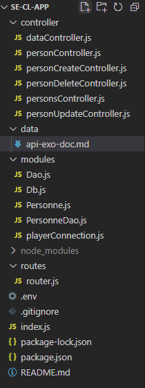

## This is the documentation for the API made with nodejs - LPCODESI 
12/03/2022  
mkdocs hosted on gh pages:  
https://omnislashh.github.io/LPCodesiApiRestDoc/
to update, after pushing /docs
```
mkdocs gh-deploy
```
Author - Elie
## Application Programming Interface RESTful

- definition  
https://www.redhat.com/en/topics/api/what-is-a-rest-api  

- further reading  
https://www.redhat.com/en/topics/api/what-are-application-programming-interfaces  

- article en français  
https://practicalprogramming.fr/api-rest  

- un exemple : l'API de wikipedia  
https://www.mediawiki.org/wiki/API:Main_page  

- cours complet  
https://openclassrooms.com/fr/courses/6573181-adoptez-les-api-rest-pour-vos-projets-web/6817216-identifiez-les-avantages-d-une-api-rest  

- autre article avec petit historique et contexte   
https://www.data-transitionnumerique.com/api-rest/
  
Une synthèse des concepts clés :  
--  
    - client/server separation
    - stateless pas de sauvegarde de queries server
    - cache
    - système en couche
    - endpoints accessibles
    - sécurisé
    - http protocol
    - interface uniforme


***
## Description: 
//API REST avec **expressjs**  
Administrer des joueurs et des équipes

- repository: https://github.com/omnislashh/ser-cli-app.git

- outils: Windows10, Wamp, nodejs, expressjs, postman

- utilisation: **CRUD** - CREATE, READ, UPDATE, DELETE

- routing - endpoints uri:
/persons
/person/:id
/data/:options
/personcreation
/personupdate
/persondelete
***
## Endpoints exemples:  

_personnes:_  
GET http://localhost:3000/persons  
GET http://localhost:3000/persons/1  
GET http://localhost:3000/personsfree  

PATCH http://localhost:3000/personupdate?id=35&name=updated&prenom=prenomUp&date=1980-05-06  
PATCH http://localhost:3000/personupdate?id=2&name=updatedJustName  
PATCH http://localhost:3000/personupdate?id=2&name=&prenom=updatedJustPrenom  
PATCH http://localhost:3000/personupdate?id=2&name=&prenom=&date=1980-08-06  

PUT http://localhost:3000/personcreation?name=Casillas&prenom=Iker&date=1981-05-20  
DELETE http://localhost:3000/persondelete?id=6  

_departements:_  
GET http://localhost:3000/departements  
GET http://localhost:3000/departement/1  
GET http://localhost:3000/departementsfree  

PUT http://localhost:3000/departementcreation?nom=France  

PATCH http://localhost:3000/departementupdate?id=3&nom=Olympique-de-Marseille  

DELETE http://localhost:3000/departementdelete?id=3  

***
## Verbes http utilisés et justifications :  
 
**PUT** plus naturel pour les créations et mises à jour complètes (URI ressource ressource créée = URI de la requête PUT)  
**PATCH** pour les mises à jour partielles  
**POST** en dernier recours (contrainte à la création d'une ressource liée avec Header Location)

- codes utilisés:   
https://developer.mozilla.org/en-US/docs/Web/HTTP/Status
***
## Architecture: 
**MVC** - client/server en local
***
## Arborescence:  

***
## Design pattern:

1. singleton pour se connecter une seule fois
2. choix design pattern pour Data Access Object:
table data getaway design pattern vs active record

avantage table data getaway:
separe la couche metier de la couche persistante
***
## Notes additionnelles :  
// la class Dao implemente le Dal (Data Access Layer)  
// en javascript (syntaxe : CommonJS) : pas de classe abstraite 
 
// classe abstraite definition :   
// empecher la creation d'objet + lister les methodes qui doivent etre implantée + declencher des erreurs  

// solutions :  
// 1 - code heroes https://www.codeheroes.fr/2017/11/08/js-classes-abstraites-et-interfaces/

// 2 - babel - pas conseillé en prod

// 3 - use typescript  
- bdd:   
// scripts sql in /data/BDD

- JWT:   
POST http://localhost:3000/api/login  
GET http://localhost:3000/api/me  
ajout d'une couche de securité/connexion user avec le bearer token  

https://www.wawasensei.dev/tuto/tuto-authentification-refresh-json-web-token-en-nodejs-avec-express

// stateless: sans stocker d'infos user  
// statefull: avec stockage de session  
// connexion s'appuie sur 2 tokens: l'un qui repose sur l'autre  
// deconnexion: lorsque le premier périme, le second est invalide, pas besoin de faire un logout  

***
## Améliorations prévues :  
admin des associations via api endpoints  
// **à voir** : refresh de token